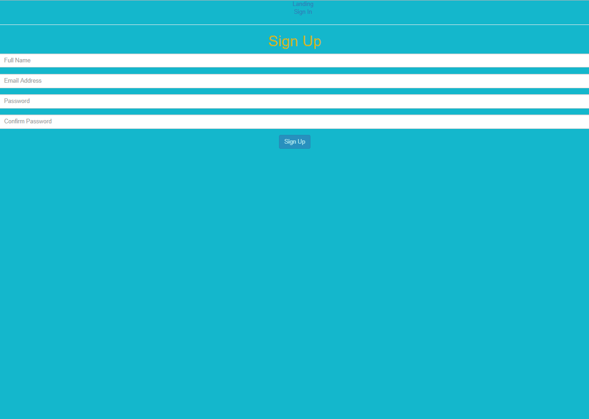

User authentication w/ firebase 
======

# How to...

1. npm install firebase react-router-dom

2. create firebase project @ https://firebase.google.com/ 

3. copy authorization config settings from `project overview` tab & paste into `./firebase/firebase.js`

4. enable email/password in sign-in providers 

What it does:
======

1. redirects user to a "home page" upon successful login 

2. shows home page only if user signed in/sign out if user signed in 

3. change password in /account & option to have firebase email link to reset password 

4. throws error if sign up email already exists

### Sign In Window

### Sign Up Window

### Signed In Window 

https://www.robinwieruch.de/complete-firebase-authentication-react-tutorial/